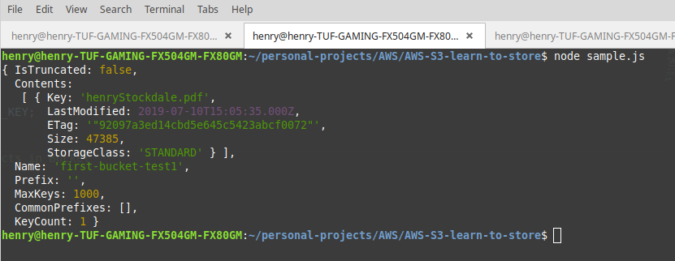

# AWS-S3-learn-to-store

**S3** 
**Node.js SDK** 
**IAM** 

## Contents returned from Bucket

## Why?

- To better understand Amazon's object storage system accessible via internet, cli & REST/SOAP APIs.
- As an intro to AWS SDKs

## What? 

- S3 (Simple Storage System) can be plainly understood as an <b>object storage system</b>.
- S3 stores & protects assets for websites, apps, IoT devices, analytics etc
- S3 uses <b>Buckets</b> which are roughly equivalent to <b>folders</b>
- Inside of a Bucket is data for retrieval - in this example I retrieved a copy of my CV (henryStockdale.pdf) from a Bucket (first-bucket-test1)

## Important lessons learnt

- <b>AWS IAM: Identity and Access Management </b>
- IAM is broken down into the following sections
  - Groups
  - Users 
  - Roles
  - Policies
- Best Practise dictates definining permission on the <b>Group</b> level and affording said permission to inidividual <b>Users</b> by adding the latter to the former. 

- Setting up IAM in this way, a User profile was made inheriting from its group the requisite permissions to access s3 Buckets.
- Both accessKeyId and secretAccessKey were stored as environment variables on my machine. 
